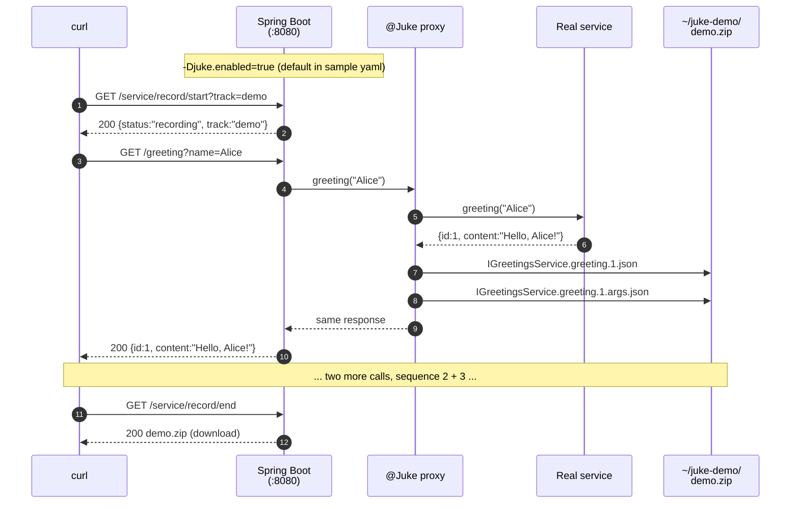

# Juke in 15 minutes: a visual walk-through

> **Audience.** Someone new to Juke who wants to see — concretely, on
> their own machine — what the framework actually does. By the end of
> this walk-through you will have:
>
> 1. Recorded a deterministic ZIP track of a live service.
> 2. Replayed it and seen identical responses regardless of input.
> 3. Watched Juke flag a tampered input as a mismatch.
> 4. Seen what a "false positive" looks like (an auto-incremented `id`
>    that legitimately differs across runs) and how `juke-approved.json`
>    or `@JukeIgnorable` make the comparison ignore it.
> 5. Driven the same flows visually through Playwright in a real
>    Chrome window.
> 6. Pulled a consolidated session report — and functional coverage
>    (server + UI) — for the runs you drove.
>
> Everything below is copy-pasteable. Allow ~15 minutes.

---

## Table of contents

1. [What you'll see](#what-youll-see)
2. [Prerequisites & one-time setup](#prerequisites--one-time-setup)
3. [Demo 1 — Deterministic record / replay](#demo-1--deterministic-record--replay)
4. [Demo 2 — Detecting an input mismatch](#demo-2--detecting-an-input-mismatch)
5. [Demo 3 — Visual run with Playwright `--ui`](#demo-3--visual-run-with-playwright---ui)
6. [Demo 4 — False positives & ignored fields](#demo-4--false-positives--ignored-fields)
7. [Demo 5 — Session reports & test coverage](#demo-5--session-reports--test-coverage)
8. [Appendix A — Recording file format](#appendix-a--recording-file-format)
9. [Appendix B — Configuration reference](#appendix-b--configuration-reference)

---

## What you'll see

Four flows, one shared mental model:

```
                          ┌───────────────────────────────┐
                          │      Your Spring Boot app     │
                          │  (juke-sample-greeting jar)   │
                          └───────────────┬───────────────┘
                                          │
              REST endpoint ──────────────┼─────► @Juke-wrapped DAO
              GET /greeting?name=Alice    │       (JukeGreetingsDAO)
                                          │              │
                                          │              ▼
                                          │      IGreetingsService
                                          │      ┌───────┴───────┐
                                          │      │               │
                                          ▼      ▼               ▼
                            ┌─────────────────┐ ┌─────────────────┐
                  Record  → │  the real impl  │ │  Replay handler │ ← Replay
                            │ (writes a ZIP)  │ │  (reads the ZIP)│
                            └─────────────────┘ └─────────────────┘
```

The single switching point is the `@Juke`-annotated field on the DAO.
Nothing in the controller, service, or any upstream HTTP client needs
to know whether Juke is recording, replaying, or off — the framework
swaps the proxy on the field at startup.

---

## Prerequisites & one-time setup

| Tool | Version | Check |
|---|---|---|
| JDK | **25+** (active on `PATH`) | `java -version` |
| Maven | 3.9+ | `mvn -version` |
| `curl` | any | `curl --version` |
| Free TCP port | `8080` | `lsof -i :8080` or `netstat -ano \| findstr 8080` |

> **JDK gotcha for dev machines with multiple Java installs.** Run
> `java -version` *before* trying any `java -jar` step. If it prints
> `class file version 52.0` or `1.8.0_…` you're on Java 8 and the
> sample jar will refuse to start with
> `UnsupportedClassVersionError: … class file version 61.0` (Spring
> Boot 3's loader is Java-17-compiled) or `class file version 69`
> (the sample's own bytecode is Java-25-compiled). Two fixes for the
> current shell:
>
> ```powershell
> # PowerShell — JDK 25 for this session only
> $env:JAVA_HOME = "C:\path\to\jdk-25"
> $env:PATH = "$env:JAVA_HOME\bin;$env:PATH"
> java -version    # should now print "openjdk 25..."
> ```
>
> ```bash
> # bash / zsh
> export JAVA_HOME=/path/to/jdk-25
> export PATH="$JAVA_HOME/bin:$PATH"
> java -version
> ```
>
> Or just qualify every invocation with the full path:
> `& "C:\path\to\jdk-25\bin\java.exe" "-Djuke.enabled=true" …`

```bash
# From the repo root — one-time build.
mvn -DskipTests install
```

This produces (among others):

```
juke-samples/juke-sample-greeting/target/juke-sample-greeting-0.0.1-SNAPSHOT.jar
juke-samples/juke-sample-todo/target/juke-sample-todo-0.0.1-SNAPSHOT.jar
```

The greeting jar bundles a React UI under `/`. The todo jar exposes a
plain REST CRUD surface at `/todos`. Both also mount Juke's
`/service/*` control endpoints (record / replay / session start-stop).

Create a working directory to hold the recordings produced by the demo
so it doesn't pollute `$HOME/juke`:

```bash
mkdir -p ~/juke-demo            # macOS / Linux / Git-Bash on Windows
```

```powershell
New-Item -ItemType Directory -Path "$HOME\juke-demo" -Force | Out-Null   # PowerShell
```

> **Shell note for Windows users.** Every `java -D...` invocation in
> this doc is written with each `-D` flag double-quoted. That is
> deliberate: PowerShell splits unquoted `-Djuke.enabled=true` into
> two arguments (`-Djuke` and `.enabled=true`) and you get
> `Error: Could not find or load main class .enabled=true`. The
> quoted form works identically in `bash`, `zsh`, and PowerShell —
> copy the commands as-written and they'll just work. If you
> prefer the unquoted form, PowerShell users can prepend `--%`
> (stop-parsing token) to the `java` invocation.

---

## Demo 1 — Deterministic record / replay

> **Goal.** Capture three live calls to `/greeting`, then prove that
> replay returns *exactly* those responses — independent of what name
> the caller sends.

### Sequence



### Run it

Start the greeting sample with `~/juke-demo` as the storage path:

```bash
java "-Djuke.enabled=true" \
     "-Djuke.path=$HOME/juke-demo" \
     "-Djuke.zip=demo" \
     -jar juke-samples/juke-sample-greeting/target/juke-sample-greeting-0.0.1-SNAPSHOT.jar &
```

(On PowerShell drop the trailing `&` — PowerShell uses
`Start-Process` or `Start-Job` for background jobs. The quotes on
each `-D` flag are required either way; see the shell note above.)

Wait ~5s for `Started GreetingApplication in 4.2 seconds`, then:

```bash
curl -s "http://localhost:8080/service/record/start?track=demo"
# → Starting Test Run: demo

curl -s "http://localhost:8080/greeting?name=Alice"
# → {"id":1,"content":"Hello, Alice!"}

curl -s "http://localhost:8080/greeting?name=Bob"
# → {"id":2,"content":"Hello, Bob!"}

curl -s "http://localhost:8080/greeting?name=Charlie"
# → {"id":3,"content":"Hello, Charlie!"}

curl -s -OJ "http://localhost:8080/service/record/end"
# Server streams demo.zip back with Content-Disposition: attachment.
# -OJ tells curl to save it under the server-supplied filename — you
# end up with ./demo.zip in the current directory. The framework
# also persists the same ZIP under ${juke.path}/demo.zip.
```

Open the ZIP to see what was captured:

```bash
unzip -l ~/juke-demo/demo.zip
# Archive:  /home/you/juke-demo/demo.zip
#   Length     Date    Time    Name
# ---------  ---------- -----   ----
#       38  2026-05-14 09:11   IGreetingsService.greeting.1.json
#      92   2026-05-14 09:11   IGreetingsService.greeting.1.args.json
#       36  2026-05-14 09:11   IGreetingsService.greeting.2.json
#      90   2026-05-14 09:11   IGreetingsService.greeting.2.args.json
#       40  2026-05-14 09:11   IGreetingsService.greeting.3.json
#      94   2026-05-14 09:11   IGreetingsService.greeting.3.args.json
# ---------                   -------
```

Two files per call: the response (`.json`) and the input sidecar
(`.args.json`). See [Appendix A](#appendix-a--recording-file-format)
for the schema.

### Now replay — same ZIP, different input

Open a session against the recording (per-session replay, no JVM
restart needed):

```bash
curl -c /tmp/jc.txt -s "http://localhost:8080/service/session/start?track=demo"
# → {"status":"active","sessionId":"…","track":"demo"}
```

The server set two cookies on your jar (`JUKE_SESSION_ID` +
`JUKE_TRACK`); we save them to `/tmp/jc.txt` so future calls carry them.

```bash
# Notice: we send "Zelda" but the recording was Alice/Bob/Charlie.
curl -b /tmp/jc.txt -s "http://localhost:8080/greeting?name=Zelda"
# → {"id":1,"content":"Hello, Alice!"}   ← recorded call #1

curl -b /tmp/jc.txt -s "http://localhost:8080/greeting?name=Yoshi"
# → {"id":2,"content":"Hello, Bob!"}     ← recorded call #2

curl -b /tmp/jc.txt -s "http://localhost:8080/greeting?name=Xenia"
# → {"id":3,"content":"Hello, Charlie!"} ← recorded call #3
```

**This is the deterministic guarantee.** The upstream service was
never invoked — Juke served the recorded responses by sequence.
The caller's input doesn't matter (yet — Demo 2 changes that).

> **Try it:** stop the replay session with
> `curl -b /tmp/jc.txt "http://localhost:8080/service/session/stop"`
> and then `curl "http://localhost:8080/greeting?name=Zelda"` — the
> response is now the live `{"id":4,"content":"Hello, Zelda!"}`.

Leave the server running for the next demo.

---

## Demo 2 — Detecting an input mismatch

> **Goal.** Show that Juke catches the case where a replay caller sends
> *different inputs* than the recording captured — useful as a
> regression signal when a refactor changes what the upstream sees.

By default Juke runs replay-time arg validation in `warn` mode: a
mismatch logs `INPUT MISMATCH [...]` and lets the test continue.
Switching to `strict` mode turns the mismatch into a thrown exception
(`JukeReplayMismatchException`), which Spring Boot returns as 500 to
the caller.

### Run it

Kill the previous server, then relaunch with strict mode:

```bash
# Stop the previous server (the one launched in Demo 1).
kill %1 2>/dev/null || pkill -f juke-sample-greeting

java "-Djuke.enabled=true" \
     "-Djuke.path=$HOME/juke-demo" \
     "-Djuke.zip=demo" \
     "-Djuke.args-validation=strict" \
     -jar juke-samples/juke-sample-greeting/target/juke-sample-greeting-0.0.1-SNAPSHOT.jar &
```

Open a fresh session and drive the same number of calls as the
recording — but with **different inputs**:

```bash
curl -c /tmp/jc.txt -s "http://localhost:8080/service/session/start?track=demo"
# → {"status":"active",...}

# Call #1 — record-time was "Alice"; we send "Alice" too → matches.
curl -b /tmp/jc.txt -s "http://localhost:8080/greeting?name=Alice"
# → {"id":1,"content":"Hello, Alice!"}

# Call #2 — record-time was "Bob"; we send "Beatrice" → mismatch.
curl -b /tmp/jc.txt -i -s "http://localhost:8080/greeting?name=Beatrice"
# HTTP/1.1 500
# {"timestamp":"…","status":500,"error":"Internal Server Error","path":"/greeting"}
```

The 500 body is Spring Boot's default error envelope and doesn't
itself name the field that mismatched. The real diagnostic shows up
on the running jar's stderr:

```
ERROR 39420 --- [...] o.j.f.proxy.ReplayHandler  : Unexpected invocation exception during
  replay of IGreetingsService.greeting:
  org.juke.framework.exception.JukeReplayMismatchException:
    Recorded args: [Bob]  Current args: [Beatrice]
```

The sequenced id (`IGreetingsService.greeting.2`) is the second call
to `greeting` in this session — it tells you which entry in the ZIP
disagreed with the live caller. Pair this with the ZIP's
`IGreetingsService.greeting.2.args.json` sidecar to see exactly what
the recording expected.

### Three modes — pick what suits the environment

| `-Djuke.args-validation=` | On mismatch | When to use |
|---|---|---|
| `off` | nothing | local debugging where you want to drive arbitrary input against a ZIP |
| `warn` *(default)* | logs `INPUT MISMATCH [...]` | CI; surfaces drift without failing the build |
| `strict` | throws `JukeReplayMismatchException` (HTTP 500) | gate jobs — fail if the caller's wire shape has changed |

> **Why this matters.** A refactor that changes a method signature or
> the JSON shape of an argument will silently produce wrong replay
> behaviour unless someone is watching for it. Strict mode turns that
> silent drift into a loud test failure.

---

## Demo 3 — Visual run with Playwright `--ui`

> **Goal.** See Demos 1 + 2 happen in a real visible Chrome window so
> you (or anyone you're showing this to) can watch the URL bar,
> DevTools cookies, and the React UI in real time.

A Playwright spec ships with the session sample for exactly this:

```
juke-samples/juke-sample-session/src/test/playwright/e2e/juke-demo.spec.ts
```

Start the greeting sample as in Demo 1 (just `juke.enabled=true`,
default `juke.args-validation=warn`), then in another terminal:

**macOS / Linux:**

```bash
cd juke-samples/juke-sample-session/src/test/playwright

# One-time setup (Node 18+ required — Playwright 1.52 needs Node ≥ 18)
npm install
npx playwright install chromium

# Run with the Playwright UI inspector
npx playwright test --project="Juke Demo" juke-demo.spec.ts --ui
```

**Windows (PowerShell) — the repo ships Node 22 via frontend-maven-plugin; use it:**

```powershell
cd juke-samples\juke-sample-session\src\test\playwright

# Point your shell at the bundled Node 22 (only needed once per terminal)
$env:Path = "$(Resolve-Path ..\..\..\..\..\juke-sample-greeting\.node\node);$env:Path"

# One-time setup
npm install
npx playwright install chromium

# Run with the Playwright UI inspector
npx playwright test --project="Juke Demo" juke-demo.spec.ts --ui
```

The Playwright UI opens. Click ▶ next to **"Juke demo — full record /
replay walk-through"**. A real Chrome window pops up and slowly
performs all five phases.

**Phase 1 — Recording** (after the title card)
1. `service/record/start?track=demo&label=…` → success banner. The
   optional `label` is stored in the ZIP and surfaces in the Phase 5
   report.
2. Three calls to `/greeting` with names Alice / Bob / Charlie — each
   response is held on screen so you can read it before the next nav.
3. `service/record/end` — the ZIP downloads.

**Phase 2 — Normal replay** (after the title card)
4. `service/session/start?track=demo&description=…` — open DevTools →
   Application → Cookies and watch `JUKE_SESSION_ID` + `JUKE_TRACK` appear.
5. Three calls to `/greeting` with the *same* names Alice / Bob /
   Charlie — every recorded-vs-actual input matches, so the session
   ends `COMPLETED`.

**Phase 3 — Stop & fall through to live** (after the title card)
6. `service/session/stop` — cookies clear; the next `/greeting?name=Zelda`
   call returns the *live* `Hello, Zelda!` payload from the real service.

**Phase 4 — Input mismatch** (after the title card)
7. A fresh session described "Run with unexpected inputs" sends
   WrongName_A / B / C. Responses still replay Alice / Bob / Charlie by
   sequence, but every input now mismatches → the session ends
   `COMPLETED_WITH_DEVIATIONS` and a styled comparison card is rendered.

**Phase 5 — Session report** (after the title card)
8. Navigates to `service/recording/report?track=demo` — the
   community-edition JSON showing both completed sessions side by side:
   one `COMPLETED`, one `COMPLETED_WITH_DEVIATIONS`. See Demo 5 for the
   endpoint in detail.

### Pacing

The spec is tuned for human-readable playback, not test throughput:

| Setting | Value | What it controls |
|---|---|---|
| `slowMo` (in `test.use({launchOptions:...})`) | `2000 ms` | Pause before every click / navigation |
| `READ_MS` | `3000 ms` | Hold each `/greeting` JSON response on screen after it loads |
| `INTRO_MS` | `4500 ms` | How long each phase's title-card stays up (with a live "resuming in Ns" countdown) |
| `BETWEEN_PHASES_MS` | `1500 ms` | Buffer between the end of one phase and the title card of the next |

Total run time is ~2.5 minutes. Edit those four constants at the top of
`juke-demo.spec.ts` to speed it up or slow it down.

To record an mp4 / gif for sharing:

```bash
npx playwright test --project="Juke Demo" juke-demo.spec.ts \
  --headed \
  --trace=on \
  --video=on
# Output lands under playwright-report/ + test-results/
# Open the trace with: npx playwright show-trace test-results/.../trace.zip
```

The trace viewer shows every Playwright step, every network request,
and every cookie change side-by-side — copy-paste-friendly for bug
reports and walkthroughs.

---

## Demo 4 — False positives & ignored fields

> **Goal.** Show the case Juke *correctly* flags as a mismatch but
> that is actually expected — e.g. an auto-generated ID or timestamp
> that legitimately differs between record-time and replay-time —
> and the two ways to silence it.

The todo sample is the right shape for this: every `POST /todos`
returns a `{id, title, completed}` payload whose `id` is auto-
incremented from an in-memory counter that starts at 1 on every
boot. Two runs of the same recording → two different `id` sequences
→ false-positive mismatch.

### The setup

```bash
# Boot the todo sample with arg-validation in strict mode.
java "-Djuke.enabled=true" \
     "-Djuke.path=$HOME/juke-demo" \
     "-Djuke.zip=todos" \
     "-Djuke.args-validation=strict" \
     -jar juke-samples/juke-sample-todo/target/juke-sample-todo-0.0.1-SNAPSHOT.jar &

# Record three creates.
curl -s "http://localhost:8080/service/record/start?track=todos"
curl -s -X POST -H 'Content-Type: application/json' \
     -d '{"title":"buy milk"}' http://localhost:8080/todos
# → {"id":1,"title":"buy milk","completed":false}
curl -s -X POST -H 'Content-Type: application/json' \
     -d '{"title":"call dentist"}' http://localhost:8080/todos
# → {"id":2,"title":"call dentist","completed":false}
curl -s -OJ "http://localhost:8080/service/record/end"

# Restart the JVM — in-memory counter resets to 1.
kill %1
java "-Djuke.enabled=true" \
     "-Djuke.path=$HOME/juke-demo" \
     "-Djuke.zip=todos" \
     "-Djuke.args-validation=strict" \
     -jar juke-samples/juke-sample-todo/target/juke-sample-todo-0.0.1-SNAPSHOT.jar &

# Drive some pre-test traffic to push the in-memory counter forward.
curl -s -X POST -H 'Content-Type: application/json' \
     -d '{"title":"warmup"}' http://localhost:8080/todos
# → {"id":1,"title":"warmup","completed":false}
# The next real create would be id=2, but the recording expects id=1.
```

### The Playwright-comparison view

The framework ships a separate **output-comparison engine** for end-
to-end Playwright recordings (`PlaywrightComparisonEngine` +
`ApprovedIgnores`). Run two Playwright executions of the same flow
against this todo backend, save both as JSON, and diff:

```bash
# Hypothetical CLI runner — see PlaywrightComparisonEngine for the API.
java -cp juke-framework/target/juke-framework-0.0.1-SNAPSHOT.jar \
     org.juke.framework.playwright.ComparisonRunner \
     --baseline baseline-run.json \
     --actual current-run.json \
     --approved juke-approved.json \
     --out comparison-report.json
```

`comparison-report.json` lists every diff bucketed as `mismatch`,
`recorded-only`, or `actual-only`. **Without** `juke-approved.json`
the report flags every `$.id` field as a mismatch — exactly the false
positive we want to silence.

### The fix — `juke-approved.json`

Drop a file alongside the recording:

```json
{
  "POST /todos": [
    "$.id"
  ],
  "GET /todos": [
    "$[*].id"
  ],
  "POST /orders": [
    "$.orderId",
    "$.timestamp",
    "$.items[*].uuid"
  ]
}
```

Keys are HTTP verb + path. Values are JSONPath expressions that the
engine should skip during comparison. `[*]` matches any array index.
Re-run the comparison and `$.id` no longer surfaces — the report shrinks
to only legitimate drift.

### The alternative — `@JukeIgnorable`

For per-field control inside the application code (rather than an
external JSON file), Juke ships an annotation:

```java
import org.juke.framework.annotation.JukeIgnorable;
import org.juke.framework.annotation.JukeIgnorable.IgnoreStrategy;

public class ToDo {

    @JukeIgnorable                                   // always-skip
    private final long id;

    @JukeIgnorable(strategy = IgnoreStrategy.NOT_NULL) // skip value diff,
    private Instant createdAt;                         // but still flag null vs non-null

    private String title;                            // compared normally
    private boolean completed;
    …
}
```

Two strategies:

| Strategy | Behaviour |
|---|---|
| `ALWAYS` *(default)* | Skip this field in every comparison regardless of value. Right for opaque generated IDs / UUIDs. |
| `NOT_NULL` | Skip only when both sides are non-null. A null-vs-non-null mismatch still surfaces — right for timestamps that must always be present but whose exact value varies. |

> **Scope note.** `@JukeIgnorable` is picked up automatically by the
> scenario service's `IgnoreRuleSeeder` when a recording is loaded
> into the admin UI (Enterprise tier). In the standalone Community
> framework the annotation is documentation-only — use
> `juke-approved.json` for runtime control of the output-comparison
> engine. The annotation will start applying automatically when you
> add the scenario service to your stack.

---

## Demo 5 — Session reports & test coverage

> **Goal.** Drive replay sessions, then pull a single consolidated
> report of every run's outcome — and, with the coverage build, of how
> much of the application under test those runs exercised.

Demos 1–2 used `curl` against a single session. Real suites run *many*
sessions; Juke keeps a per-track history and renders it as JSON.

### The session report

Record a track with a human-readable **label**, then run a session
with a **description** — both are optional query params:

```bash
# Record — note the optional &label
curl -s "http://localhost:8080/service/record/start?track=demo&label=Greetings%20smoke%20test"
curl -s "http://localhost:8080/greeting?name=Alice"
curl -s "http://localhost:8080/greeting?name=Bob"
curl -s -OJ "http://localhost:8080/service/record/end"

# Replay — note the optional &description
curl -c /tmp/jc.txt -s "http://localhost:8080/service/session/start?track=demo&description=Normal%20replay"
curl -b /tmp/jc.txt -s "http://localhost:8080/greeting?name=Alice"
curl -b /tmp/jc.txt -s "http://localhost:8080/greeting?name=Bob"
curl -b /tmp/jc.txt -s "http://localhost:8080/service/session/stop"
```

Now fetch the consolidated report:

```bash
curl -s "http://localhost:8080/service/recording/report?track=demo"
```

```json
{
  "track" : "demo",
  "label" : "Greetings smoke test",
  "recordedAt" : "2026-05-19T…",
  "sessions" : [ {
    "sessionId" : "…",
    "description" : "Normal replay",
    "callCount" : 2,
    "overallStatus" : "COMPLETED",
    "calls" : [ {
      "sequence" : 1, "method" : "greeting",
      "recordedArguments" : [ "Alice" ], "actualArguments" : [ "Alice" ],
      "inputMatched" : true
    } ]
  } ]
}
```

Each completed (stopped) session is kept with its description, its
per-call recorded-vs-actual arguments, and an `overallStatus` of
`COMPLETED` or `COMPLETED_WITH_DEVIATIONS` — the latter whenever any
call's input didn't match the recording. A companion endpoint,
`GET /service/recording/inputs?track=demo`, returns just the recorded
input sidecars. (This report works against the plain Demo 1 server —
no special build needed.)

### Functional coverage — opt-in

Juke can also report how much of the application under test a run
exercised: **server** coverage via JaCoCo, **UI** coverage via
Istanbul/nyc. It is an opt-in capability — no runtime cost unless
turned on — intended for local / UAT, never production.

Build the **coverage edition** of the greeting sample (the `-Pcoverage`
profile builds the React SPA instrumented):

```bash
mvn -pl juke-samples/juke-sample-greeting -am package -Pcoverage
```

Launch with the bundled demo script — it auto-attaches the JaCoCo agent
and sets the `juke.coverage.*` properties:

```
juke-samples/juke-sample-greeting/demo-start-server.ps1   # Windows PowerShell
juke-samples/juke-sample-greeting/demo-start-server.bat   # Windows cmd
```

(The manual equivalent is `-javaagent:target/jacoco-agent.jar=output=none`
plus `-Djuke.coverage.enabled=true` and the `-Djuke.coverage.classes` /
`-Djuke.coverage.sources` paths — see [Appendix B](#appendix-b--configuration-reference).)

**Server coverage** is read live, in-process. Drive any replay flows,
then:

```bash
curl -s "http://localhost:8080/service/coverage/server"
```

```json
{ "available" : true, "tool" : "JaCoCo",
  "instruction" : 84.2, "branch" : 71.0, "line" : 86.5,
  "analyzedClasses" : 4,
  "excludedSeams" : [ "com.example.greeting.IGreetingsService -> com.example.greeting.GreetingServiceImpl" ],
  "reportUrl" : "/coverage/server/index.html" }
```

The drill-down HTML report is served at
`http://localhost:8080/coverage/server/index.html`. Classes Juke
mocked via `@Juke` are excluded automatically — in replay mode they
never execute, so counting them would understate the real figure. The
developer never names an implementation class; Juke records what it
displaced.

**UI coverage** comes from a Playwright run that drives the React SPA.
Run the `Coverage` project (it uses `greeting-ui.spec.ts`):

```bash
cd juke-samples/juke-sample-session/src/test/playwright
npx playwright test --project="Coverage" e2e/greeting-ui.spec.ts
```

The run's teardown writes an nyc report to `~/juke-demo/coverage/ui`;
the server then surfaces it:

```bash
curl -s "http://localhost:8080/service/coverage/ui"
# → { "available":true, "tool":"nyc/Istanbul",
#     "lines":78.0, "statements":77.4, "functions":80.0, "branches":62.5,
#     "reportUrl":"/coverage/ui/index.html" }
```

HTML report: `http://localhost:8080/coverage/ui/index.html`.

> **Production note.** The `/service/coverage/*` endpoints exist only
> when `juke.coverage.enabled=true` *and*, for server coverage, the
> JaCoCo agent is attached — both are set only in local / UAT launches.
> A production deployment leaves them off and pays nothing.

---

## Appendix A — Recording file format

Every recording is a flat ZIP. For each `Interface.method()` call:

```
${returnType-of-method}/                              ← optional path prefix per Juke version
IGreetingsService.greeting.1.json                     ← response payload
IGreetingsService.greeting.1.args.json                ← input sidecar
IGreetingsService.greeting.2.json
IGreetingsService.greeting.2.args.json
IGreetingsService.greeting.3.json
IGreetingsService.greeting.3.args.json
```

The `.N` is the **per-method sequence number**. Calls to different
methods get independent counters.

**Response file** (`*.greeting.1.json`):

```json
{"id":1,"content":"Hello, Alice!"}
```

Whatever the method returned, serialised by Jackson.

**Input sidecar** (`*.greeting.1.args.json`):

```json
{
  "method": "greeting",
  "parameterTypes": ["java.lang.String"],
  "arguments": ["Alice"]
}
```

`parameterTypes` is the exact resolved Java parameter list — Juke
uses it for type-discriminator matching when an interface has
overloads.

---

## Appendix B — Configuration reference

All Juke settings can be passed as `-D` flags, environment variables
(`JUKE_*`), or YAML keys (`juke.*`). The samples set defaults via YAML
in `src/main/resources/application.yml`; everything below overrides at
runtime.

| Setting | Default | Purpose |
|---|---|---|
| `juke.enabled` | `false` | Master toggle. When false, the framework wires no proxies and `/service/*` endpoints don't map. Always set to `true` in the samples' YAML. |
| `juke.path` | `${user.home}/juke` | Directory holding the recording ZIPs. Created if missing. |
| `juke.zip` | `juke-track` | Base filename for the recording ZIP (`.zip` is appended). |
| `juke.args-validation` | `warn` | One of `off` / `warn` / `strict`. Controls the replay-time input check (Demo 2). |
| `juke.headless-runner.enabled` | `false` | Reserved for the Enterprise headless test runner. Leave off in Community use. |
| `juke.coverage.enabled` | `false` | Opt-in master toggle for the functional-coverage feature — the `/service/coverage/*` endpoints and static report serving. Needs `juke-coverage` on the classpath; server coverage additionally needs the JaCoCo `-javaagent` attached. |
| `juke.coverage.classes` | *(unset)* | Path to the application-under-test's `target/classes`, analysed for server (JaCoCo) coverage. |
| `juke.coverage.sources` | *(unset)* | Path to the application's `src/main/java`; enables source highlighting in the server HTML report. |
| `juke.coverage.report-dir` | `${user.home}/juke-demo/coverage/server` | Where the server JaCoCo HTML report is written (served at `/coverage/server/`). |
| `juke.coverage.ui-report-dir` | `${user.home}/juke-demo/coverage/ui` | Where the Playwright/nyc UI report is read from (served at `/coverage/ui/`). |
| `juke.coverage.bundle-name` | `Application under test` | Display name for the server coverage bundle. |

Per-environment YAML profiles can layer over these:

```yaml
# application.yml (the default — production-leaning, Juke off)
juke:
  enabled: false

---
# application-local.yml (-Dspring.profiles.active=local)
juke:
  enabled: true
  path: ${user.home}/juke-local
  args-validation: strict
```

---

## What to try next

- **Add a third sample.** The `juke-sample-session` module
  demonstrates per-session replay where two browser contexts replay
  different recordings simultaneously without restarting the JVM.
  See [`juke-samples/juke-sample-session`](./juke-sample-session) for
  its README and the included Playwright cookie-isolation spec.

- **Wire `@Juke` into your own app.** The annotation goes on
  *interface-typed fields* (or constructor parameters) for upstream
  collaborators you want to record / replay. Field name and method
  signatures don't matter — Juke discovers them reflectively. See
  [`juke-samples/juke-sample-annotations`](./juke-sample-annotations)
  for field / method / constructor variants.

- **Move beyond standalone.** Connect the scenario service to get the
  full Enterprise feature set: aggregated recordings, deep per-field
  ignore rules driven by `@JukeIgnorable`, coverage-aware run
  planning, and the admin UI. See
  [`COMMUNITY_GUIDE.md`](../COMMUNITY_GUIDE.md) and
  [`ENTERPRISE_GUIDE.md`](../ENTERPRISE_GUIDE.md).
